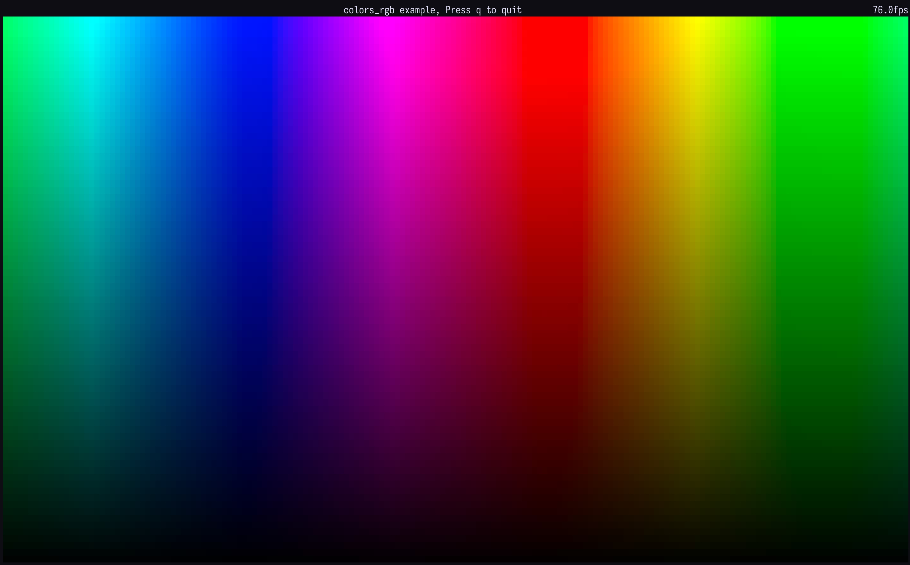

# Kiko

**Note**: This project is a work in progress and will be updated as time permits.

Kiko is a Dart port of the [Ratatui](https://ratatui.rs/) Rust framework for building TUI (Text User Interface) applications.

The basics are working, but event handling and some other features still need to be implemented.

## Declarative Layout DSL

Kiko supports a Flutter/SwiftUI-style declarative API for layouts:

```dart
// Before (imperative)
void draw(Frame frame) {
  final layout = Layout.vertical([
    ConstraintLength(4),
    ConstraintLength(50),
    ConstraintMin(0),
  ]);
  final [headerArea, contentArea, _] = layout.areas(frame.area);
  frame.renderWidget(header, headerArea);
  frame.renderWidget(content, contentArea);
}

// After (declarative)
void draw(Frame frame) {
  final ui = Column(
    children: [
      Fixed(4, child: Header(...)),
      Fixed(50, child: Content(...)),
      Expanded(child: Footer(...)),
    ],
  );
  frame.renderWidget(ui, frame.area);
}
```

### Layout Widgets

| Widget          | Description                             |
| --------------- | --------------------------------------- |
| `Row`           | Horizontal flex layout                  |
| `Column`        | Vertical flex layout                    |
| `Grid`          | Grid layout with row/column constraints |
| `LayoutBuilder` | Access computed `Rect` in a callback    |
| `Padding`       | Add spacing around a child              |

### Constraint Wrappers

| Widget                       | Constraint                |
| ---------------------------- | ------------------------- |
| `Fixed(n, child:)`           | `ConstraintLength(n)`     |
| `MinSize(n, child:)`         | `ConstraintMin(n)`        |
| `Percent(n, child:)`         | `ConstraintPercent(n)` |
| `Expanded(child:)`           | `ConstraintFill(1)`       |
| `ConstraintChild(c, child:)` | Any custom constraint     |

### Grid Example

```dart
Grid(
  rows: 5,
  columns: 5,
  rowConstraint: const ConstraintLength(9),
  columnConstraint: const ConstraintLength(14),
  cellBuilder: (row, col) => MyCell(row: row, col: col),
)
```

See `example/layout_v2.dart` for a complete example.

## Examples

## Layout


## Colors


## RGB



## Development

Setup git hooks (runs lint + tests on commit):

```bash
git config core.hooksPath .githooks
```
